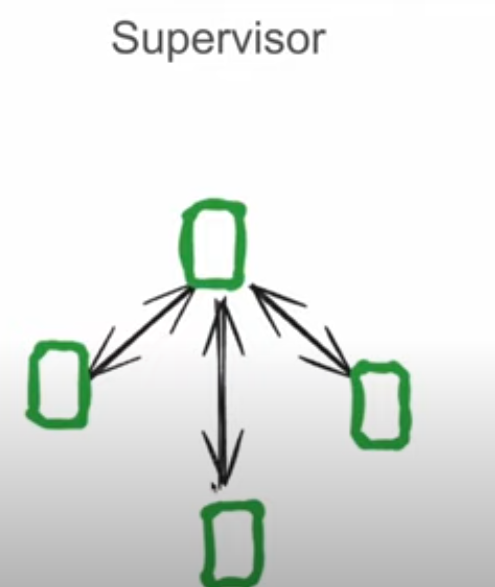

## 1. Supervisor-Based Systems

<table>
  <tr>
    <td></td>
    <td></td>
  </tr>
  - There is Supervisor Agent connected to dependent Agents 
</table>

## 2. Hierarchical Systems

- There is Supervisor Agent connected to dependent sub groups each group has its sub supervisor 

## 3. Custom Multi-Agent Systems

## 4. Equi-Level Systems
- Could Say there is Multi agent as same level and System has Router Model with its diffrent types like LLM-Single-router Like in LLama_index or LLM-Multi-router  
